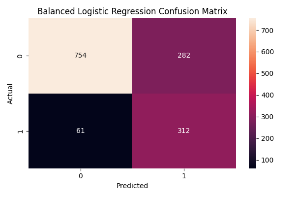

# Customer Churn Prediction using Machine Learning

## Project Overview

This project predicts whether a telecom customer is likely to churn using customer demographic, service, contract, and billing information. The goal is to help a company identify customers who may leave, so that retention actions can be taken earlier.

## Problem Statement

Customer churn is a major business problem because losing existing customers can reduce revenue. This project uses machine learning to predict churn and identify important factors that influence customer cancellation.

## Dataset

The project uses the Telco Customer Churn dataset, which contains customer information such as gender, tenure, contract type, monthly charges, total charges, internet service, and churn status.

- Rows: 7043
- Columns: 21
- Target column: Churn

## Technologies Used

- Python
- Pandas
- NumPy
- Matplotlib
- Seaborn
- Scikit-learn
- Joblib
- Jupyter Notebook

## Project Workflow

1. Loaded and explored the dataset
2. Checked missing values and data types
3. Converted `TotalCharges` into numeric format
4. Removed the `customerID` column
5. Encoded categorical variables using Label Encoding
6. Split the dataset into training and testing sets
7. Trained multiple machine learning models
8. Compared model performance using accuracy, recall, F1-score, and confusion matrix
9. Selected the best model based on churn recall
10. Saved the final model and scaler using Joblib

## Models Used

- Logistic Regression
- Scaled Logistic Regression
- Balanced Logistic Regression
- Random Forest Classifier

## Model Performance

The Balanced Logistic Regression model was selected as the final model because it achieved the highest churn recall.

| Model | Accuracy | Churn Recall | Churn F1-score |
|---|---:|---:|---:|
| Logistic Regression | 0.81 | 0.57 | 0.62 |
| Scaled Logistic Regression | 0.82 | 0.58 | 0.62 |
| Balanced Logistic Regression | 0.76 | 0.84 | 0.65 |
| Random Forest | 0.80 | 0.47 | 0.55 |

## Why Churn Recall Matters

In a churn prediction problem, recall for churn customers is more important than overall accuracy. If the model misses customers who are likely to leave, the company may lose revenue. The Balanced Logistic Regression model detects more churn customers, making it more useful for business decision-making.

## Key Insights

- Customers with low tenure are more likely to churn.
- Monthly charges are an important factor in churn prediction.
- Contract type has a strong relationship with churn.
- Customers with month-to-month contracts are more likely to leave.
- Support-related services such as online security and tech support influence churn.

## Visualizations

### Confusion Matrix



### Model Comparison


### Top 10 Important Features


## Final Model

The final model used in this project is:

**Balanced Logistic Regression**

The trained model and scaler were saved using Joblib:

```text
models/logistic_regression_balanced.pkl
models/scaler.pkl